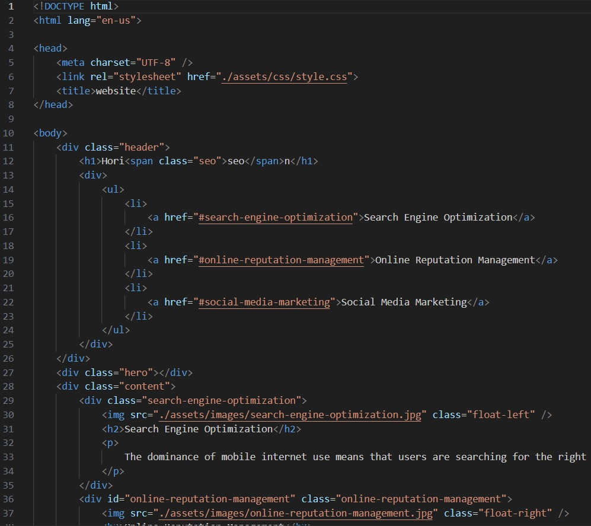

# Code-Refactoring
Refactor codebase in HTML and CSS for an example website

## Description

For this project, I had to take an index.html file and its corresponding css stylesheet and refactor the code in order to use more semantic elements where appropriate. Here is the original index.HTML file:


The original index file was filled with div elements to separate almost everything. Not very developer-friendly at all. So I changed multiple elements to semantically describe their purpose. Some examples were using `main` and `aside` tags for the main content on the page and the sidebar.

I'm not sure if this is common/best practice, but in my CSS file, I did decide to use multiple nested element selectors, for example: 
```
main {
    . . . 
    . . .
    h2 {
        . . .
    }
}

*** instead of ***

main > h2 {
    . . .
}

```
I did make this decision mainly to be more developer-friendly. For a beginner web developer at least, it can difficult to understand what is being styled when the HTML file is indented but the CSS file is not. Therefore, instead of using child/descendant selectors, I opted to nest my selectors inside of the corresponding "parent selectors". I don't typically code in CSS using nested selectors, but it did help me understand the structure of my HTML elements a little better.

### Dependencies

* An up-to-date browser

## Authors

Jordan Burton 
[@jordaneburton](https://github.com/jordaneburton)

## Acknowledgments
Thank you to Dom for the README template
* [@DomPizzie](https://twitter.com/dompizzie)
